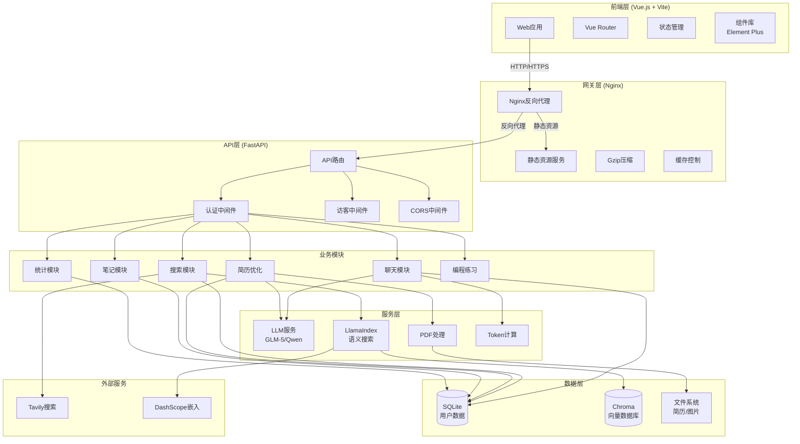
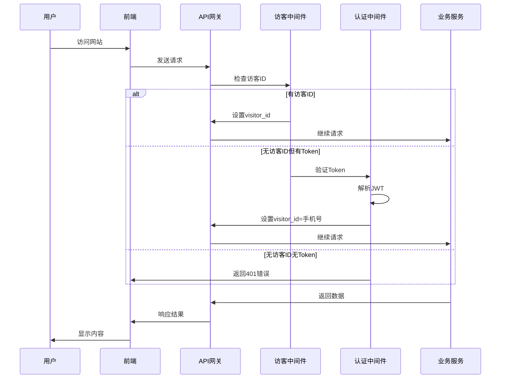
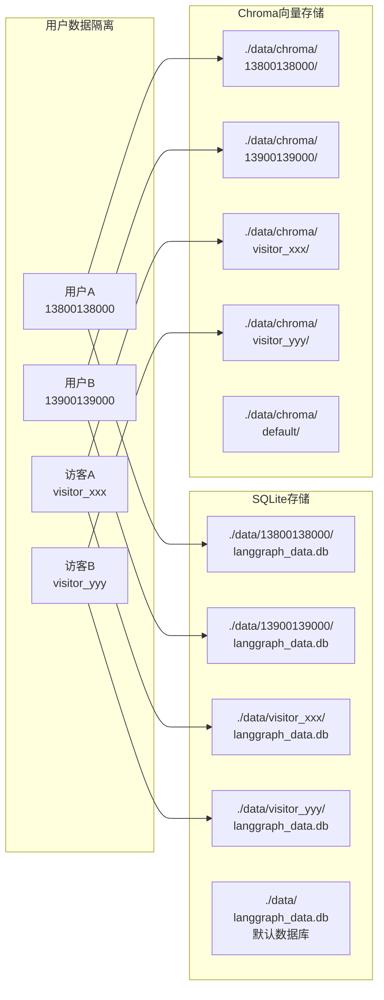
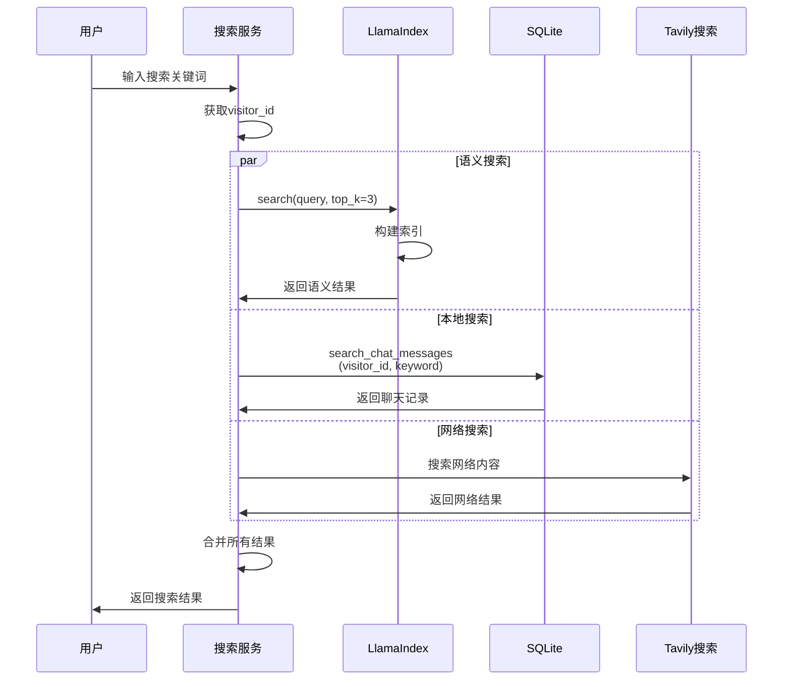
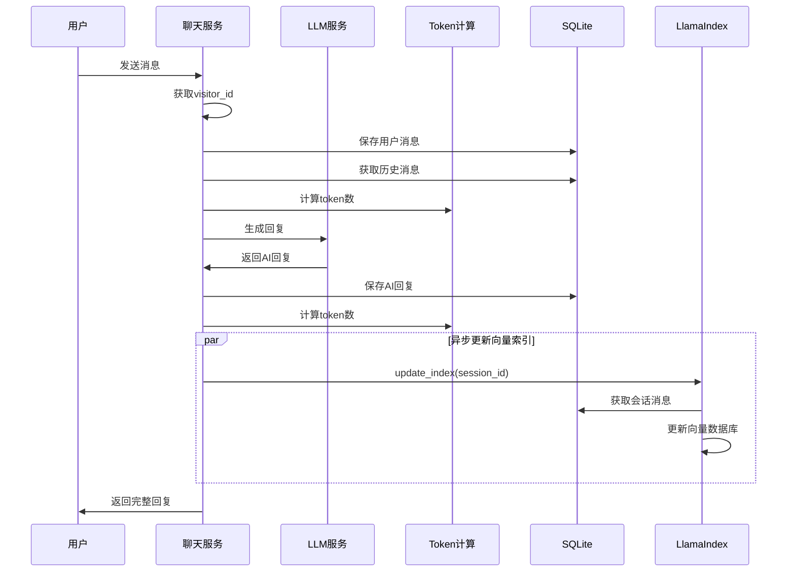
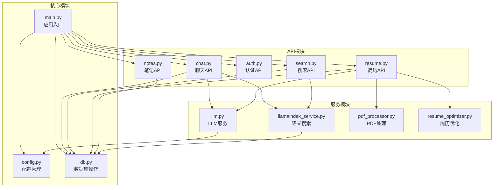
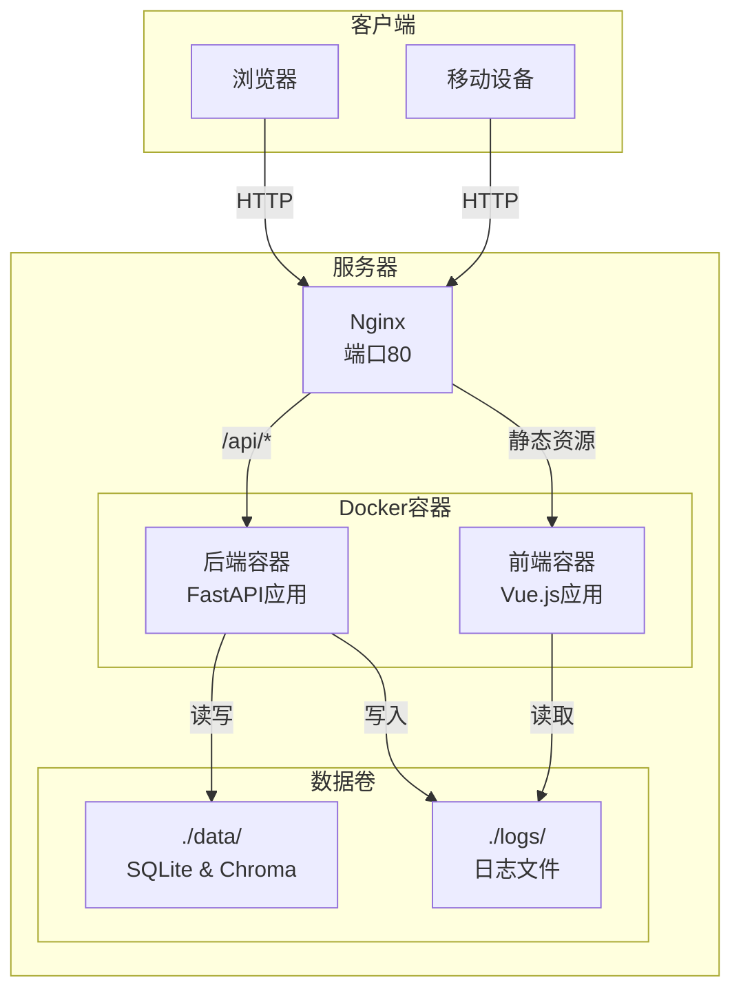

# 学氧助手系统架构图

## 整体架构

```mermaid
graph TB
    subgraph 前端层["前端层 (Vue.js + Vite)"]
        FE[Web应用]
        Router[Vue Router]
        Store[状态管理]
        Components[组件库<br/>Element Plus]
    end

    subgraph 网关层["网关层 (Nginx)"]
        Nginx[Nginx反向代理]
        Static[静态资源服务]
        Gzip[Gzip压缩]
        Cache[缓存控制]
    end

    subgraph API层["API层 (FastAPI)"]
        API[API路由]
        Auth[认证中间件]
        Visitor[访客中间件]
        CORS[CORS中间件]
    end

    subgraph 业务模块["业务模块"]
        Chat[聊天模块]
        Search[搜索模块]
        Resume[简历优化]
        Notes[笔记模块]
        Stats[统计模块]
        Coding[编程练习]
    end

    subgraph 服务层["服务层"]
        LLM[LLM服务<br/>GLM-5/Qwen]
        LLamaIndex[LlamaIndex<br/>语义搜索]
        PDF[PDF处理]
        Tokenizer[Token计算]
    end

    subgraph 数据层["数据层"]
        SQLite[(SQLite<br/>用户数据)]
        Chroma[(Chroma<br/>向量数据库)]
        FileSystem[文件系统<br/>简历/图片]
    end

    subgraph 外部服务["外部服务"]
        Tavily[Tavily搜索]
        DashScope[DashScope嵌入]
    end

    %% 连接关系
    FE -->|HTTP/HTTPS| Nginx
    Nginx -->|反向代理| API
    Nginx -->|静态资源| Static

    API --> Auth
    API --> Visitor
    API --> CORS

    Auth --> Chat
    Auth --> Search
    Auth --> Resume
    Auth --> Notes
    Auth --> Stats
    Auth --> Coding

    Chat --> LLM
    Chat --> Tokenizer
    Search --> LLamaIndex
    Search --> Tavily
    Resume --> PDF
    Resume --> LLM

    LLamaIndex --> Chroma
    LLamaIndex --> DashScope
    Chat --> SQLite
    Search --> SQLite
    Resume --> SQLite
    Notes --> SQLite
    Stats --> SQLite

    PDF --> FileSystem
```

## 认证流程

```mermaid
sequenceDiagram
    participant User as 用户
    participant FE as 前端
    participant API as API网关
    participant Visitor as 访客中间件
    participant Auth as 认证中间件
    participant Service as 业务服务

    User->>FE: 访问网站
    FE->>API: 发送请求
    API->>Visitor: 检查访客ID

    alt 有访客ID
        Visitor->>API: 设置visitor_id
        API->>Service: 继续请求
    else 无访客ID但有Token
        Visitor->>Auth: 验证Token
        Auth->>Auth: 解析JWT
        Auth->>API: 设置visitor_id=手机号
        API->>Service: 继续请求
    else 无访客ID无Token
        Auth->>FE: 返回401错误
    end

    Service->>API: 返回数据
    API->>FE: 响应结果
    FE->>User: 显示内容
```

## 数据存储架构

```mermaid
graph LR
    subgraph 用户隔离["用户数据隔离"]
        direction TB
        User1[用户A<br/>13800138000]
        User2[用户B<br/>13900139000]
        Visitor1[访客A<br/>visitor_xxx]
        Visitor2[访客B<br/>visitor_yyy]
    end

    subgraph SQLite存储["SQLite存储"]
        direction TB
        DB1[./data/13800138000/<br/>langgraph_data.db]
        DB2[./data/13900139000/<br/>langgraph_data.db]
        DB3[./data/visitor_xxx/<br/>langgraph_data.db]
        DB4[./data/visitor_yyy/<br/>langgraph_data.db]
        DBDefault[./data/<br/>langgraph_data.db<br/>默认数据库]
    end

    subgraph 向量存储["Chroma向量存储"]
        direction TB
        Vec1[./data/chroma/<br/>13800138000/]
        Vec2[./data/chroma/<br/>13900139000/]
        Vec3[./data/chroma/<br/>visitor_xxx/]
        Vec4[./data/chroma/<br/>visitor_yyy/]
        VecDefault[./data/chroma/<br/>default/]
    end

    User1 --> DB1
    User2 --> DB2
    Visitor1 --> DB3
    Visitor2 --> DB4

    User1 --> Vec1
    User2 --> Vec2
    Visitor1 --> Vec3
    Visitor2 --> Vec4
```

## 搜索流程

```mermaid
sequenceDiagram
    participant User as 用户
    participant Search as 搜索服务
    participant LLamaIndex as LlamaIndex
    participant SQLite as SQLite
    participant Tavily as Tavily搜索

    User->>Search: 输入搜索关键词
    Search->>Search: 获取visitor_id

    par 语义搜索
        Search->>LLamaIndex: search(query, top_k=3)
        LLamaIndex->>LLamaIndex: 构建索引
        LLamaIndex->>Search: 返回语义结果
    and 本地搜索
        Search->>SQLite: search_chat_messages<br/>(visitor_id, keyword)
        SQLite->>Search: 返回聊天记录
    and 网络搜索
        Search->>Tavily: 搜索网络内容
        Tavily->>Search: 返回网络结果
    end

    Search->>Search: 合并所有结果
    Search->>User: 返回搜索结果
```

## 聊天流程

```mermaid
sequenceDiagram
    participant User as 用户
    participant Chat as 聊天服务
    participant LLM as LLM服务
    participant Tokenizer as Token计算
    participant SQLite as SQLite
    participant LLamaIndex as LlamaIndex

    User->>Chat: 发送消息
    Chat->>Chat: 获取visitor_id
    Chat->>SQLite: 保存用户消息
    Chat->>SQLite: 获取历史消息
    Chat->>Tokenizer: 计算token数

    Chat->>LLM: 生成回复
    LLM->>Chat: 返回AI回复

    Chat->>SQLite: 保存AI回复
    Chat->>Tokenizer: 计算token数

    par 异步更新向量索引
        Chat->>LLamaIndex: update_index(session_id)
        LLamaIndex->>SQLite: 获取会话消息
        LLamaIndex->>LLamaIndex: 更新向量数据库
    end

    Chat->>User: 返回完整回复
```

## 模块依赖关系

```mermaid
graph TD
    subgraph 核心模块["核心模块"]
        Main[main.py<br/>应用入口]
        Config[config.py<br/>配置管理]
        DB[db.py<br/>数据库操作]
    end

    subgraph API模块["API模块"]
        ChatAPI[chat.py<br/>聊天API]
        SearchAPI[search.py<br/>搜索API]
        AuthAPI[auth.py<br/>认证API]
        ResumeAPI[resume.py<br/>简历API]
        NotesAPI[notes.py<br/>笔记API]
    end

    subgraph 服务模块["服务模块"]
        LLMService[llm.py<br/>LLM服务]
        LLamaIndexService[llamaindex_service.py<br/>语义搜索]
        PDFService[pdf_processor.py<br/>PDF处理]
        ResumeService[resume_optimizer.py<br/>简历优化]
    end

    Main --> Config
    Main --> DB
    Main --> ChatAPI
    Main --> SearchAPI
    Main --> AuthAPI
    Main --> ResumeAPI
    Main --> NotesAPI

    ChatAPI --> DB
    ChatAPI --> LLMService
    ChatAPI --> LLamaIndexService

    SearchAPI --> DB
    SearchAPI --> LLamaIndexService

    ResumeAPI --> DB
    ResumeAPI --> PDFService
    ResumeAPI --> ResumeService
    ResumeAPI --> LLMService

    NotesAPI --> DB

    LLamaIndexService --> DB
    LLMService --> Config
```

## 部署架构

```mermaid
graph TB
    subgraph 客户端["客户端"]
        Browser[浏览器]
        Mobile[移动设备]
    end

    subgraph 服务器["服务器"]
        Nginx[Nginx<br/>端口80]

        subgraph Docker容器["Docker容器"]
            Frontend[前端容器<br/>Vue.js应用]
            Backend[后端容器<br/>FastAPI应用]
        end

        subgraph 数据卷["数据卷"]
            Data[./data/<br/>SQLite & Chroma]
            Logs[./logs/<br/>日志文件]
        end
    end

    Browser -->|HTTP| Nginx
    Mobile -->|HTTP| Nginx

    Nginx -->|静态资源| Frontend
    Nginx -->|/api/*| Backend

    Backend -->|读写| Data
    Backend -->|写入| Logs
    Frontend -->|读取| Logs
```
